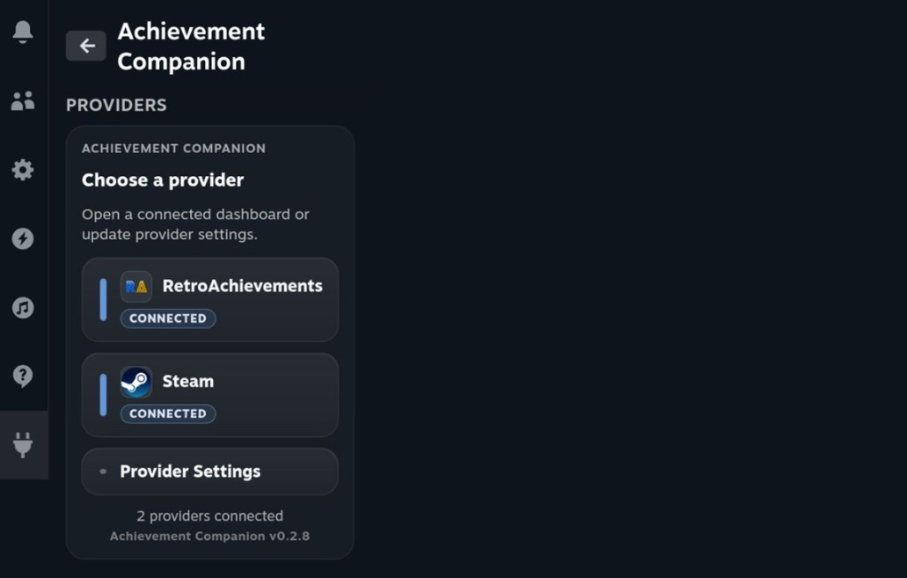
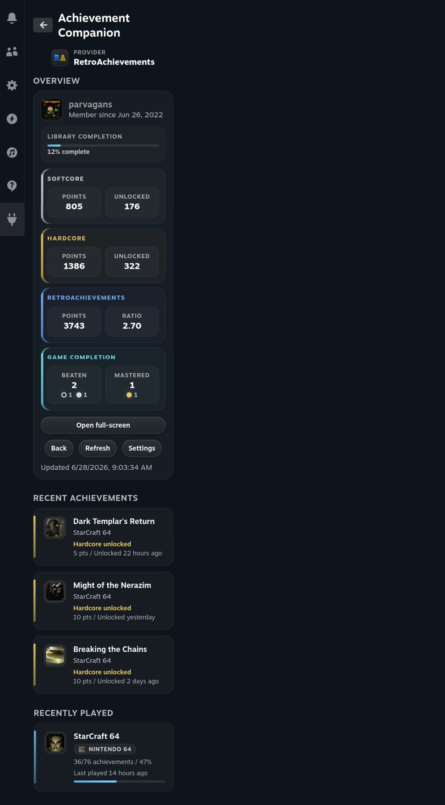
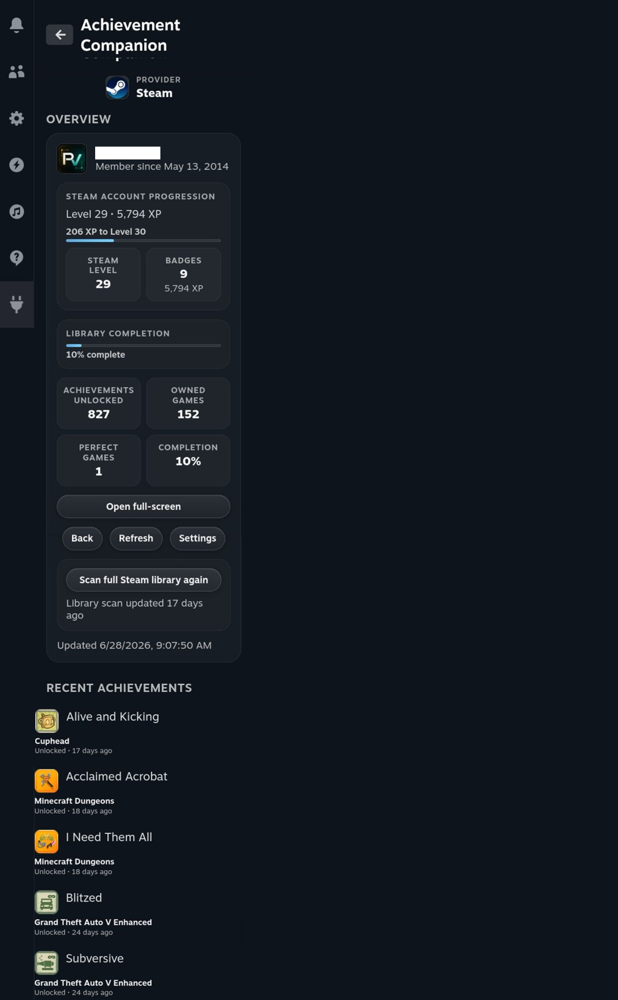

# Achievement Companion


Achievement Companion brings RetroAchievements and Steam achievement progress into Steam Deck Game Mode through a provider-first Decky dashboard. It gives you compact quick views, fuller browsing screens, recent unlocks, recently played games, completion progress, and Steam library achievement totals while keeping provider API keys out of browser storage.

## Highlights

- RetroAchievements and Steam support in one provider-first Decky dashboard
- Compact quick-access views plus fullscreen achievement browsing
- Recent unlocks, recently played games, profile stats, and completion progress
- Manual Steam full-library scan for cached account-wide achievement totals
- Provider-specific settings for recent counts and Steam scan preferences
- Backend-owned credential handling with secret-safe logs and frontend-safe config

## Screenshots

### Provider Chooser

<p align="center">
  
</p>

### RetroAchievements Overview

<p align="center">
  
</p>

### Steam Overview

<p align="center">
  
</p>

## Supported Providers

### RetroAchievements

Connect your RetroAchievements account to browse your profile, recent unlocks, recently played games, and completion progress from the Decky quick-access menu. You can also adjust how many recent achievements and recently played games appear for the provider.

- View your RetroAchievements profile and avatar
- See recent unlocks with game and achievement details
- Browse recently played games
- Check completion and progress information where RetroAchievements provides it
- Configure how many recent achievements and recently played games appear

### Steam

Connect your Steam Web API key and SteamID64 to view Steam achievement activity, recent games, profile progression, and full-library achievement totals from the Decky quick-access menu.

- View Steam profile details, level, badges, and account progression where available
- See recently played Steam games
- Surface recent achievement unlocks from loaded or recent games
- Run a manual full-library scan for broader achievement totals
- Show cached full-library totals such as owned games, unlocked achievements, total achievements, perfect games, and completion percentage
- Configure Steam display options such as recent counts, language, and played free games

## Privacy and Credential Handling

Achievement Companion is designed so provider API keys do not live in the browser frontend. After you save a provider account, the frontend-facing config only receives non-secret settings such as username, SteamID64, display counts, language, and whether a key exists. Secret-bearing provider requests are handled by the backend.

- Provider config: `/home/deck/homebrew/settings/achievement-companion/provider-config.json`
- Provider secrets: `/home/deck/homebrew/settings/achievement-companion/provider-secrets.json`
- Backend logs: `/home/deck/homebrew/logs/achievement-companion/`

Additional notes:

- API keys are not stored in browser localStorage/sessionStorage
- API keys are stored separately from non-secret provider settings
- Backend logs are designed to redact secret-like fields and provider URLs containing key or y parameters
- Provider config is saved separately from provider secrets
- Secret storage uses local protected/obfuscated records, not a guarantee against a compromised local account

If you need to rotate or revoke an API key, do that from the provider website and then update the plugin settings on the Deck.

## Steam Library Scan

Steam library scanning is manual because larger Steam libraries can take several minutes to check.

- The scan updates the Steam overview with the latest full-library totals
- Cached totals include owned games, unlocked achievements, total achievements, perfect games, and completion percentage
- Some games may be skipped or fail if Steam reports no stats, private data, or unavailable achievement data
- Skipped or failed games are normal for some Steam libraries and do not necessarily mean the scan failed

## License and Notices

- Achievement Companion is not affiliated with, endorsed by, sponsored by, or approved by RetroAchievements or Valve Corporation.
- This project is released under the BSD-3-Clause License. See [`LICENSE`](LICENSE).
- Third-party dependency notes are recorded in [`THIRD_PARTY_NOTICES.md`](THIRD_PARTY_NOTICES.md).

## Installation

Build and package the plugin locally, then install the generated release zip with your normal Decky Loader workflow.

```bash
pnpm install
pnpm run build
pnpm run package:release
pnpm run check:release
```

## Development

- `pnpm install`
- `pnpm run typecheck`
- `pnpm test`
- `pnpm run build`
- `pnpm run package:release`
- `pnpm run check:release`

## Contact / Support

Email: [`nullbit5@protonmail.com`](mailto:nullbit5@protonmail.com)

If you prefer repository-based support, use the project issue tracker on GitHub.

## Release Layout

The release zip is packaged as:

```text
achievement-companion/
  dist/index.js
  main.py
  package.json
  plugin.json
  README.md
  LICENSE
  THIRD_PARTY_NOTICES.md
```
